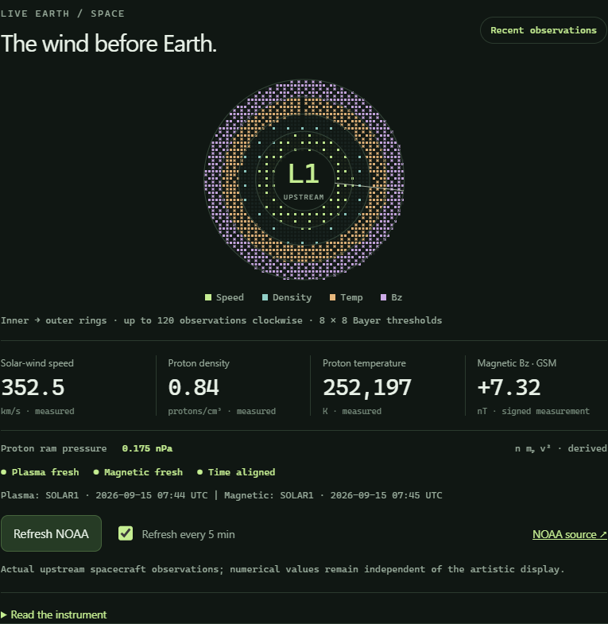

# ZERO

**A live population observatory for your desktop.**

ZERO 1.2 puts a continuously ticking global population estimate at the center of
an instrument panel: signed distance and strain, AC/DC signal statistics, a
Fourier spectrum, and a virtual FMCW/Doppler radar. A compact Pomodoro timer stays
available underneath. Expand the panel to explore the instruments.


The Windows app stays **always on top**, starts at **Windows sign-in**, and lives
in the system tray. Drag its header to move it; double-click to dock it at the
bottom right. Pin and startup preferences can be changed in Settings or the tray.

## What the instruments mean

| Instrument | Meaning |
| --- | --- |
| Population clock | U.S. Census Bureau world estimate, interpolated between published time anchors. |
| Signed distance / strain | Distance along the population count axis and change in parts per million from your saved reference. |
| Quarter bridge | A virtual bridge-voltage analogy derived from population strain. |
| AC/DC multimeter and FFT | Statistics and frequency analysis of a synthetic signal around the population baseline. |
| FMCW / Doppler | A virtual radar simulation with user-set range and velocity, modeled chirps, and beat frequencies. |
| Earth / space Bayer atlas | Live NOAA solar-wind speed, density, temperature and interplanetary Bz, mapped into four ordered-dither rings. |
| Power, current, energy | Hypothetical values using adjustable watts per person and voltage. |

The clock is an estimate, not an individual-by-individual live census. Its source
date and offline/extrapolation status are visible. The other instruments do not
measure people, EEG, radio signals, or global electricity use. No microphone,
radar, or other sensor is accessed. See [instrument equations](docs/INSTRUMENTS.md)
and the [population, energy, and timer model](docs/MODEL.md). The Earth / space
panel uses measured NOAA data with separate timestamps, freshness indicators and
derived proton dynamic pressure. Read the [telemetry mapping](docs/TELEMETRY.md).



## Windows installation

Install [Node.js](https://nodejs.org/en/download) **22.12 or newer**, clone or
download this repository, and run `INSTALL-Windows.cmd`. Or use PowerShell in the
source folder:

```powershell
npm ci
npm run package:windows
powershell -NoProfile -File scripts/install-windows.ps1
```

The installer creates Desktop and Start menu shortcuts and installs the app at
`%LOCALAPPDATA%\Programs\ZERO\ZERO.exe`. The installed app includes Electron and
works without Node.js or the source folder. It starts when your Windows account
signs in after boot; it does not run on the Windows login screen.

To update an existing installation after fetching new source:

```powershell
npm ci
npm run package:windows
powershell -NoProfile -File scripts/install-windows.ps1 -Update
```

The **× button hides the app to the tray** while its timer continues. Click the
tray icon to show it again, or choose **Quit ZERO** to exit. Settings, timer state,
and the last population snapshot are saved locally. Read the
[Windows guide](docs/WINDOWS.md) for startup, portable builds, and stored data.

## Browser, macOS, and Linux

Open `index.html` for an immediate browser preview using the bundled population
snapshot. For a browser preview with a local Census feed proxy, install Python
3.9+ and run `python server.py` (`python3 server.py` on many macOS/Linux systems).
The local server opens `http://127.0.0.1:8765/`; `--offline` disables fetching.

For the Electron desktop host on any supported platform:

```sh
npm ci
npm start
```

| Platform | Desktop launcher | Browser/proxy launcher |
| --- | --- | --- |
| Windows | `DESKTOP-Windows.cmd` | `START-Windows.bat` |
| macOS | `DESKTOP-macOS.command` | `START-macOS.command` |
| Linux | `desktop-linux.sh` | `start-linux.sh` |

The first desktop installation needs internet access. Afterward the bundled or
saved population source works offline. Browser placement stays inside its window;
use the desktop host for native pinning. macOS/Linux launchers may need
`chmod +x *.command *.sh`. Linux Wayland can restrict placement and pinning;
`npm run start:x11` starts Electron through X11/XWayland where available.
Automatic startup installation is provided for Windows.

## Controls and data

| Control | Action |
| --- | --- |
| M / expand icon | Switch compact and expanded instruments |
| S / settings | Open preferences |
| Space | Start or pause the timer |
| R | Reset the current interval |
| N | Skip to the next interval |
| Pin icon | Toggle always on top in desktop mode |
| MODEL / source label | Source details, refresh, JSON import/export, and formulas |
| Escape | Close settings or model notes |

The timer defaults to 25-minute focus, 5-minute break, and 15-minute long break
after four completed focuses. It restores its deadline after sleep or relaunch;
each next interval waits for you to start it. A skip does not count as completion.

Automatic population refresh runs on launch and every six hours when enabled.
Manual refresh and validated Census JSON import are available in MODEL. Export
saves a model report; it is not a restorable settings backup. Use one browser tab
per local origin to avoid competing saves. The desktop host uses a single instance.
There are no accounts, analytics, or advertising.

Earth / space refreshes from NOAA every five minutes when enabled. Its last valid
observations are cached locally; unavailable channels remain visibly missing or
stale. Freeze stops instrument animation while the population and timer continue.

## Development and builds

```sh
npm run check
npm test
```

The syntax and model checks need Node.js and do not require installing Electron.
On Windows, `npm run package:windows` builds the standalone app and
`npm run test:desktop` exercises that package in a separate temporary profile.
See [verification scope](docs/TESTING.md).

The Windows package contains the runtime and app. Keep its files together when
copying a portable build. Development builds are unsigned.

## License

Author: **[Tom Klootwijk](AUTHORS.md)**. The author record includes the identity
and address details supplied for publication.

Original application code is [MIT licensed](LICENSE). Census source data and
bundled third-party runtimes retain their own attribution and licenses.

The [original design reference PDFs](references/README.md) are included with their
attribution and contents preserved. Their original rights and notices apply;
they are not covered by the application's MIT license. The
[instrument notes](docs/INSTRUMENTS.md) identify the selected bridge and phase
equations adapted into ZERO.
