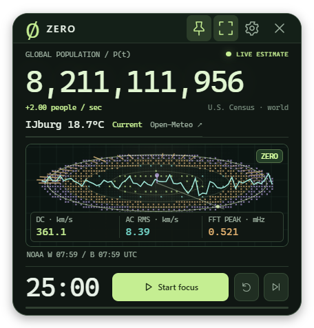
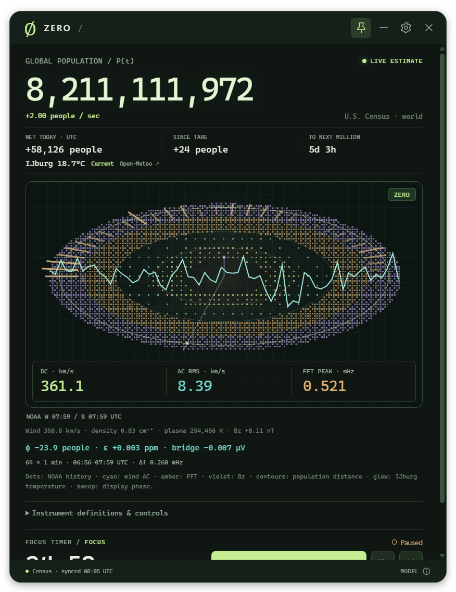

# ZERO

**A live population observatory for your desktop.**

ZERO 1.3 brings the population clock, received NOAA observations, and **IJburg
temperature** into one shared visual field. Its main **DC, AC RMS, and Fourier
readings come from actual NOAA wind-speed samples**. Population contours, Bayer
dots, the waveform, and the spectrum share the same canvas, with a Pomodoro timer
underneath.

The default compact widget is approximately **280 × 293 pixels**. Expand it for
channel values, source timestamps, the selected FFT window, and a visual legend.





The Windows app stays **always on top**, starts at **Windows sign-in**, and lives
in the system tray. Drag its header to move it; double-click to dock it at the
bottom right. Pin and startup preferences can be changed in Settings or the tray.

## One field, identifiable data

| Visual or reading | Source and meaning |
| --- | --- |
| Population clock | U.S. Census Bureau world estimate, interpolated between published time anchors. |
| Bayer dots / magnetic marker | Reported NOAA solar-wind speed, density, temperature, and signed interplanetary Bz observations. |
| Cyan waveform / DC / AC RMS | Received wind speed and its fluctuations around the selected window's mean, in km/s. |
| Amber Fourier arc / peak | Amplitude spectrum of those wind-speed samples; peak frequency in millihertz (mHz). |
| Contours / strain / quarter bridge | Modeled population change from your saved reference, with a virtual bridge-voltage analogy. |
| Thermal glow / IJburg strip | Open-Meteo weather-model temperature at 2 m for IJburg, Amsterdam, in °C. |
| Sweep | Display phase marking time. |

The app retains source values and observation timestamps. The graphics use
defined visual scales; combining channels does not imply a physical or causal
connection between them. The population remains a model, and local weather
remains model-based. NOAA supplies spacecraft measurements; ZERO accesses no
local microphone or radar hardware.

The main FFT needs **16, 32, or 64 consecutive one-minute wind samples**. Missing
minutes are never interpolated or replaced with synthetic values. A short or
interrupted latest window shows a waiting reason. See the
[live signal definitions](docs/LIVE.md), [NOAA data handling](docs/TELEMETRY.md),
and [IJburg weather details](docs/WEATHER.md).

Source updates use **periodic polling**:

| Channel | Source timing | Automatic fetch interval |
| --- | --- | --- |
| Population | Continuously interpolated source model | On launch and every 6 hours |
| NOAA wind / magnetic data | One-minute observations | Every 5 minutes |
| IJburg current weather | 15-minute model data | Every 15 minutes |

Fetching again does not create a new observation. Timestamps and saved/stale
states identify the data being shown.

The collapsed **Instrument definitions & controls** section retains optional
synthetic waveform, virtual FMCW/Doppler, and hypothetical power/energy studies.
Their assumptions are described in the [instrument equations](docs/INSTRUMENTS.md)
and [population, energy, and timer model](docs/MODEL.md).

## Windows installation

Install [Node.js](https://nodejs.org/en/download) **22.12 or newer**, clone or
download this repository, and run `INSTALL-Windows.cmd`. Or use PowerShell in the
source folder:

```powershell
npm ci
npm run package:windows
powershell -NoProfile -File scripts/install-windows.ps1
```

The installer creates Desktop and Start menu shortcuts and installs the app at
`%LOCALAPPDATA%\Programs\ZERO\ZERO.exe`. The installed app includes Electron and
works without Node.js or the source folder. It starts when your Windows account
signs in after boot; it does not run on the Windows login screen.

To update an existing installation after fetching new source:

```powershell
npm ci
npm run package:windows
powershell -NoProfile -File scripts/install-windows.ps1 -Update
```

The **× button hides the app to the tray** while its timer continues. Click the
tray icon to show it again, or choose **Quit ZERO** to exit. Settings, timer state,
and the last population snapshot are saved locally. Read the
[Windows guide](docs/WINDOWS.md) for startup, portable builds, and stored data.

## Browser, macOS, and Linux

Open `index.html` for an immediate browser preview using the bundled population
snapshot. For a browser preview with a local Census feed proxy, install Python
3.9+ and run `python server.py` (`python3 server.py` on many macOS/Linux systems).
The local server opens `http://127.0.0.1:8765/`; `--offline` disables fetching.

For the Electron desktop host on any supported platform:

```sh
npm ci
npm start
```

| Platform | Desktop launcher | Browser/proxy launcher |
| --- | --- | --- |
| Windows | `DESKTOP-Windows.cmd` | `START-Windows.bat` |
| macOS | `DESKTOP-macOS.command` | `START-macOS.command` |
| Linux | `desktop-linux.sh` | `start-linux.sh` |

The first desktop installation needs internet access. Afterward the bundled or
saved population source works offline. Browser placement stays inside its window;
use the desktop host for native pinning. macOS/Linux launchers may need
`chmod +x *.command *.sh`. Linux Wayland can restrict placement and pinning;
`npm run start:x11` starts Electron through X11/XWayland where available.
Automatic startup installation is provided for Windows.

## Controls and data

| Control | Action |
| --- | --- |
| M / expand icon | Switch compact and expanded views of the shared field |
| S / settings | Open preferences |
| Space | Start or pause the timer |
| R | Reset the current interval |
| N | Skip to the next interval |
| Pin icon | Toggle always on top in desktop mode |
| MODEL / source label | Source details, refresh, JSON import/export, and formulas |
| Escape | Close settings or model notes |

The timer defaults to 25-minute focus, 5-minute break, and 15-minute long break
after four completed focuses. It restores its deadline after sleep or relaunch;
each next interval waits for you to start it. A skip does not count as completion.

Automatic population refresh runs on launch and every six hours when enabled.
Manual refresh and validated Census JSON import are available in MODEL. Export
saves a model report; it is not a restorable settings backup. Use one browser tab
per local origin to avoid competing saves. The desktop host uses a single instance.
There are no accounts, analytics, or advertising.

The last valid NOAA and weather observations are cached locally. Unavailable
channels stay visibly missing or stale; a failed fetch adds no invented readings.

## Development and builds

```sh
npm run check
npm test
```

The syntax and model checks need Node.js and do not require installing Electron.
On Windows, `npm run package:windows` builds the standalone app and
`npm run test:desktop` exercises that package in a separate temporary profile.
See [verification scope](docs/TESTING.md).

The Windows package contains the runtime and app. Keep its files together when
copying a portable build. Development builds are unsigned.

## License

Author: **[Tom Klootwijk](AUTHORS.md)**. The author record includes the identity
and address details supplied for publication.

Original application code is [MIT licensed](LICENSE). Census source data and
bundled third-party runtimes retain their own attribution and licenses.

The [original design reference PDFs](references/README.md) are included with their
attribution and contents preserved. Their original rights and notices apply;
they are not covered by the application's MIT license. The
[instrument notes](docs/INSTRUMENTS.md) identify the selected bridge and phase
equations adapted into ZERO.
